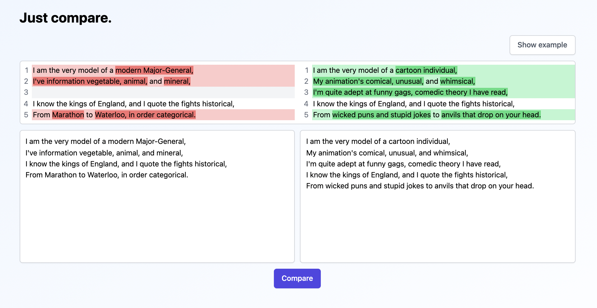

# Find diff between texts



## Development

Clone this repository, if you didn't it

```
git clone https://github.com/yurimikushov/find-diff-between-texts.git
```

Install deps

```
npm i
```

Set up git hooks by `husky`

```
npm run prepare
```

Run the app in `development` mode on `localhost:3000`

```
npm run start
```

Or build the app for `production` to the `build` folder

```
npm run build
```
